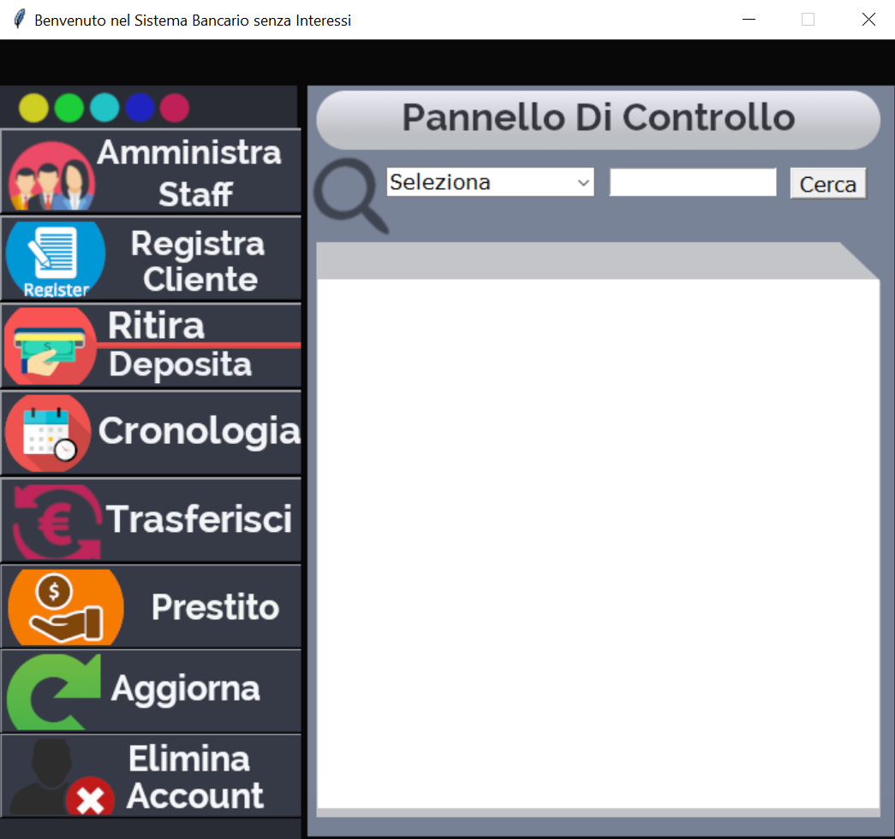

Semplice applicazione bancaria in Python , si tratta del mio primo "progetto" in assoluto utilizzando python postgresql e utilizzando la programmazione orientata agli oggetti. Sto imparando a programmare perciò se avete dei consigli su come strutturare meglio il codice o semplificare alcuni passaggi scrivetemi pure i consigli sono ben accetti sopratutto perchè sono ancora alle prime armi!

Per l'app ho utilizzato Python-Tkinter , Postgresql,Psycopg2
Ho utilizzato il modulo sql della libreria di Psycopg2 che va utilizzato per generare delle query dinamiche ma non è necessario,l'ho utilizzato solo per prendere confidenza con la libreria.

 
